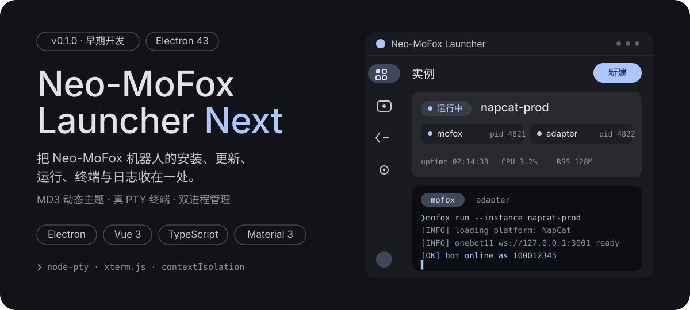
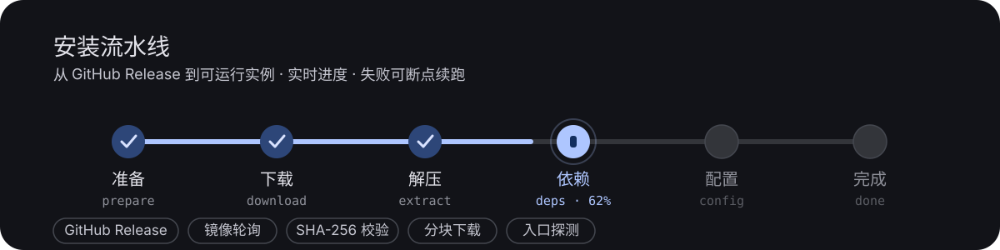
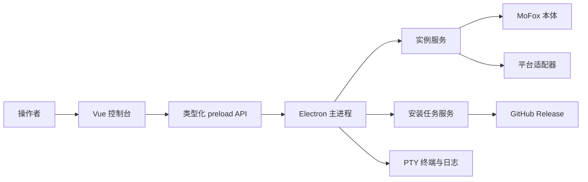

<p align="center">
  
</p>

<p align="center">
  <strong>让机器人实例的安装、运行与实时反馈成为一个可观察的 AI 工作流。</strong>
</p>

<p align="center">
  
  
  
  
  
  
  
</p>

<p align="center">
  <a href="#开始使用">开始使用</a> · <a href="#它如何工作">它如何工作</a> · <a href="#支持的适配器">支持的适配器</a> · <a href="#开发">开发</a>
</p>

---

## 为什么需要它

一个机器人实例不是单一进程：它至少包含 **MoFox 本体** 与一个 **OneBot 平台适配器**，还需要处理安装包、运行目录、终端输出和启动失败。Neo-MoFox Launcher Next 将这些对象编排为一个可观察、可恢复的运行工作流，而不是一组需要手动记忆的命令和路径。

它是 [Neo-MoFox](https://github.com/MoFox-Studio/Neo-MoFox) 的桌面辅助工具，当前仍处于早期开发阶段（`0.1.0`）。

## 一个实例，一个可观察工作流

- **建立实例**：通过安装向导选择适配器、设置目标目录并创建运行所需的实例记录。
- **控制两个进程**：按实例启动、停止或重启 MoFox 与平台适配器；运行状态会同步到界面。
- **直接看现场**：每个进程附有独立的 PTY 终端，支持日志搜索、自动滚动、行数统计与导出。
- **在失败后恢复**：安装在临时目录中执行；可取消并清理，失败任务可从失败步骤重试。
- **接管旧配置**：发现旧版启动器的 `instances.json` 后先展示迁移预览，冲突项可跳过，旧数据不被改写。
- **保留桌面体验**：提供 Material Design 3 主题、语言、日志轮转、关闭到托盘和硬件加速等设置。

<p align="center">
  
</p>

## 开始使用

### 从源码运行

需要 Node.js `18+` 与 npm。机器人环境相关的 Python、uv、Git 等依赖会在应用的引导流程中检测。

```bash
git clone https://github.com/MoFox-Studio/Neo-MoFox-Launcher.git
cd Neo-MoFox-Launcher-Next
npm ci
npm run dev
```

开发模式会同时运行 Vite、Electron 主进程、预加载脚本和 Electron 窗口。渲染服务使用 `5199` 端口。

### 仅预览界面

没有 Electron 环境时，可以在浏览器中运行包含内存 Mock API 的演示界面：

```bash
npm run dev:demo
```

## 它如何工作



### 实例是运行单元

每条实例记录保存 MoFox 安装目录、适配器路径、状态与自启动偏好。运行时服务负责创建和回收子进程；停止时按 Ctrl+C、SIGTERM、SIGKILL 的顺序升级处理，避免只留下失控的后台进程。

### 安装是可恢复工作流

安装任务依次执行准备、下载、解压、依赖、配置和完成。下载源来自 GitHub Release，适配器安装过程支持镜像轮询、SHA-256 校验、断点续传、解压目录校验和启动入口探测。任务失败后会保留可复用的前序结果，从失败阶段继续；取消会回收临时工作目录。

### 渲染层不能越过边界

文件、进程、安装和设置全部保留在 Electron 主进程。渲染进程仅通过预加载层提供的白名单 API 调用能力，应用启用 `contextIsolation` 和 `sandbox`，并关闭 `nodeIntegration`。请求通道与事件载荷由 `src/shared/ipc.ts` 统一定义。

## 支持的适配器

| 适配器                                           | 宿主环境                       | 安装来源                           |
| ------------------------------------------------ | ------------------------------ | ---------------------------------- |
| [NapCatQQ](https://github.com/NapNeko/NapCatQQ)  | Windows x64                    | GitHub Release 的 Windows Shell 包 |
| [SnowLuma](https://github.com/SnowLuma/SnowLuma) | Windows x64、Linux x64 / arm64 | GitHub Release 的完整发行包        |

> macOS 被列为应用打包目标，但当前没有可用的平台适配器实现。

## 开发

### 技术组成

| 位置         | 实现                                       |
| ------------ | ------------------------------------------ |
| 桌面运行时   | Electron `43`                              |
| 界面         | Vue `3`、Vue Router、Pinia、Material Web   |
| 主进程与桥接 | TypeScript、Electron IPC、`contextBridge`  |
| 终端         | `node-pty`、`@xterm/xterm`                 |
| 构建与质量   | Vite、TypeScript、ESLint、Prettier、Vitest |
| 发布         | electron-builder                           |

### 常用命令

| 命令                  | 用途                                                |
| --------------------- | --------------------------------------------------- |
| `npm run dev`         | 运行桌面开发环境。                                  |
| `npm run dev:demo`    | 在浏览器中运行 Mock API 演示。                      |
| `npm run typecheck`   | 检查 renderer、main 和 preload 的 TypeScript 类型。 |
| `npm test`            | 运行 Vitest 测试。                                  |
| `npm run lint`        | 执行 ESLint。                                       |
| `npm run build`       | 类型检查后构建三个入口到 `dist/`。                  |
| `npm run pack:dir`    | 构建并生成目录形式的打包产物。                      |
| `npm run package:win` | 构建 Windows x64 的 NSIS 安装包与便携版。           |

### 目录导览

```text
src/
├── main/       # Electron 主进程：IPC、实例、安装、迁移、设置与平台适配器
├── preload/    # 受限的 contextBridge API
├── renderer/   # Vue 页面、组件、路由、Pinia 状态与样式
└── shared/     # IPC 契约与领域模型

test/           # main、preload、renderer 的单元测试
```

## 打包目标

| 平台    | 格式                |
| ------- | ------------------- |
| Windows | NSIS 安装包、便携版 |
| Linux   | AppImage            |
| macOS   | dmg                 |

`node-pty` 是原生模块。`npm run pack:dir` 和 `npm run package:win` 会在打包前执行重建；其他自定义打包流程应先运行 `npm run rebuild:native`。

## 相关链接

- [Neo-MoFox](https://github.com/MoFox-Studio/Neo-MoFox)
- [重构设计说明](./docs/Neo-MoFox-Laucher.md)
- [问题反馈](https://github.com/MoFox-Studio/Neo-MoFox-Launcher/issues)
- [讨论区](https://github.com/MoFox-Studio/Neo-MoFox-Launcher/discussions)

## 许可证

本项目采用 [GNU Affero General Public License v3.0](./LICENSE)（AGPL-3.0）授权。
