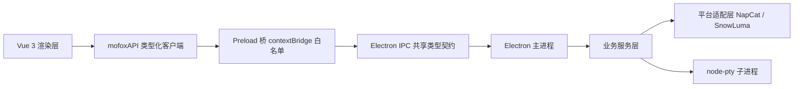

<p align="center">
  
</p>

<h3 align="center">一个桌面启动器，把 Neo-MoFox QQ 机器人实例的安装、运行、终端与日志收在一处。</h3>

<p align="center">
  
  
  
  
  
  
</p>

---

> 当前版本 `0.1.0`，处于早期开发阶段。原版启动器基于 CommonJS 与原生 HTML/CSS/JS；本工程以 TypeScript 统一重写主进程、预加载层、服务层与 Vue 3 渲染层，沿用 Material Design 3，保留 Electron 桌面运行时与既有业务语义。

## 它解决什么

跑一个 Neo-MoFox QQ 机器人，意味着同时管理 **MoFox 本体** 与 **平台适配器** 两个子进程，外加 Python 运行时、依赖安装、版本更新、日志排查与多套实例配置。命令行里开三个终端窗口、手工 `cd` 到不同目录、记住每条启动命令，是这套技术栈最常见的体验。

**Neo-MoFox Launcher Next** 把这套流程收进一个桌面应用：

- **卡片式实例列表** —— 状态（运行中 / 已停止 / 启动中 / 停止中 / 错误）一目了然，启停 / 重启 / 删除 / 打开安装目录 / 开机自启一键完成
- **双进程独立控制** —— 每个实例最多运行 MoFox 本体与平台适配器两个子进程，分别启停、分别看日志
- **实时终端** —— 基于 `node-pty` + `xterm.js`，双进程双终端独立标签页，不是文本回显而是真 PTY
- **六阶段安装流水线** —— 从 GitHub Release 拉取、镜像轮询、SHA-256 校验、断点续传到入口探测，全自动

<p align="center">
  
</p>

## 快速开始

### 环境要求

- **操作系统**：Windows 10/11（64 位）或主流 Linux 发行版；macOS 已列入打包配置，平台适配暂未覆盖
- **运行时**：Node.js 18+（推荐 LTS）与 npm

### 安装与开发

```bash
npm install
npm run dev
```

`npm run dev` 以 Vite 开发服务器（固定端口 `5199`）+ Electron 窗口的方式启动，renderer / main / preload 三端热更新并行运行。

> 没有 Electron 环境也想看界面？`npm run dev:demo` 在浏览器中预览完整 UI（Vite + 内存 Mock API，可体验实例启停、终端日志流与安装进度）。

## 核心特性

### 多实例管理

- 卡片式实例列表，状态（运行中 / 已停止 / 启动中 / 停止中 / 错误）一目了然
- 启动、停止、重启、删除实例，打开实例安装目录，支持开机自启
- 每个实例最多运行两个子进程：**MoFox 本体**与**平台适配器**，分别独立控制

### 终端与日志

- 基于 `node-pty` + `xterm.js` 的实时终端，双进程双终端独立标签页
- 日志缓冲、关键词搜索、自动滚动、行数统计、进程运行时长与 PID 展示
- 日志一键导出到启动器数据目录

### 安装向导

- 五步引导界面：选择平台 → 实例信息 → 安装位置 → 确认摘要 → 执行安装
- 后台六阶段流水线：`准备 → 下载 → 解压 → 依赖 → 配置 → 完成`，实时进度事件
- 失败可重试，取消时自动清理临时文件；关闭窗口前先取消进行中的安装任务

### 平台适配层

- 插件化平台注册表，当前内置：
  - **NapCat**（基于 NapCatQQ 的 OneBot 11 接入，Windows x64）
  - **SnowLuma**（跨平台轻量适配器，Windows x64 / Linux x64、arm64）
- 从 GitHub Release 安装，支持镜像顺序轮询、SHA-256 校验、断点续传与解压结构校验
- 智能探测实例启动入口，兼容不同版本的解压目录布局

### 开箱引导与环境检测

- OOBE 引导页，自动检测 Python、uv、Git 版本并汇总系统环境信息

### 旧版数据迁移

- 一键探测旧启动器数据目录，预览每条实例的规范化结果与冲突标记
- 支持按 ID / 路径冲突跳过，安全导入旧版 `instances.json`，不改动旧目录任何文件

### 个性化设置

- Material Design 3 动态主题：跟随系统 / 浅色 / 深色 + 种子色
- 界面语言（简体中文 / English）、默认安装目录、关闭到托盘、硬件加速开关
- 日志轮转配置（单文件大小、归档天数、归档压缩），设置原子持久化

### 安全模型

- `contextIsolation: true`、`sandbox: true`、`nodeIntegration: false`
- 渲染层仅能访问 preload 白名单 API，IPC 通道与事件均由共享类型契约约束

## 架构概览

### 进程模型



- **主进程**：承载全部可信操作 —— 文件系统、子进程与 PTY、安装任务、实例生命周期、设置持久化、窗口管理。
- **预加载桥**：唯一允许使用 `ipcRenderer` 的渲染侧边界，仅暴露白名单 API；事件订阅返回退订函数，避免组件卸载后残留监听器。
- **渲染层**：只依赖 store、类型化 API 客户端与 UI 组件，禁止直接访问 Node.js 或 `ipcRenderer`。

### IPC 类型契约

`src/shared/ipc.ts` 是三端共享契约的唯一来源：请求通道、事件通道、事件载荷映射与 `MofoxApi` 接口保持一致，并借助 `satisfies` 在编译期校验通道名不漂移。主进程错误统一编码为 `MofoxError`，在 preload 层反序列化后以业务错误形式抛给渲染层。

### 平台适配层

每个 Bot 平台实现统一的 `BotPlatform` 接口（元数据、可用性检查、安装、配置、更新、启动命令），由 `PlatformRegistry` 注册并按 ID 查找。安装流水线从 GitHub Release 选择匹配当前系统的资产，经镜像轮询下载、SHA-256 校验、解压与目录结构校验后落盘，随后由平台规则探测启动入口。

## 技术栈

| 层级 | 选型 |
| --- | --- |
| 桌面运行时 | Electron 35 |
| 主进程 / 预加载 | Node.js + TypeScript |
| 渲染层 | Vue 3（Composition API + SFC）+ Vue Router + Pinia |
| 构建工具 | Vite 6（renderer / main / preload 三入口独立构建） |
| UI | Material Design 3（`@material/web`、`@material/material-color-utilities`、`material-symbols`） |
| 终端 | `node-pty` + `@xterm/xterm`（fit / search / web-links 插件） |
| 测试 | Vitest + Vue Test Utils |
| 代码质量 | TypeScript、ESLint、Prettier |
| 打包 | electron-builder |

## 常用脚本

| 命令 | 说明 |
| --- | --- |
| `npm run dev` | 开发模式（renderer + main + preload + Electron 并行） |
| `npm run dev:demo` | 浏览器演示模式（Mock API） |
| `npm run build` | 类型检查 + 三端生产构建（输出到 `dist/`） |
| `npm run typecheck` | 三端 TypeScript 类型检查 |
| `npm test` | 运行 Vitest 单元测试 |
| `npm run lint` | ESLint 静态检查 |
| `npm run format:check` | Prettier 格式检查 |
| `npm run pack:dir` | 构建 + 重建原生模块 + electron-builder 打包目录产物（`release/`） |

## 环境变量

| 变量 | 说明 |
| --- | --- |
| `VITE_DEV_SERVER_URL` | 开发模式下 Electron 加载的渲染地址（`npm run dev` 自动设置为 `http://localhost:5199`） |
| `VITE_MOFOX_DEMO` | 设为 `true` 时启用浏览器演示 API（`src/renderer/src/services/mock-api.ts`） |
| `NEO_MOFOX_LEGACY_DATA` | 覆盖旧启动器数据目录；默认探测 `<appData>/Neo-MoFox-Launcher` |

## 项目结构

```
Neo-MoFox-Launcher-Next/
├── src/
│   ├── main/                 # Electron 主进程
│   │   ├── index.ts          # 组合根：窗口、服务装配、IPC 注册
│   │   ├── ipc/              # IPC handler（core / install / instances / migration / window）
│   │   ├── platforms/        # Bot 平台适配层（napcat / snowluma + github-installer + registry）
│   │   ├── services/         # 业务服务（实例、安装任务、环境、设置、迁移、镜像等）
│   │   └── utils/            # Node 工具层（logger、range-downloader、process-service 等）
│   ├── preload/              # 预加载桥：contextBridge 暴露白名单 mofoxAPI
│   ├── renderer/             # Vue 3 渲染层
│   │   └── src/
│   │       ├── views/        # 页面（Dashboard / Instances / InstanceLog / Install / Oobe / Settings）
│   │       ├── components/   # 通用组件（TitleBar、NavRail、InstanceCard 等）
│   │       ├── router/       # Hash 路由（Electron 渲染进程）
│   │       ├── stores/       # Pinia（instances / install / settings）
│   │       ├── services/     # mofoxAPI 客户端、主题、Mock API
│   │       └── styles/       # Material 3 设计令牌与基础样式
│   └── shared/               # 三端共享
│       ├── ipc.ts            # IPC 请求/事件通道与 MofoxApi 类型契约（唯一来源）
│       └── domain/           # 领域模型（instance / bot-platform / mirror / error 等）
├── test/                     # Vitest 单元测试（main / preload / renderer）
├── docs/                     # 重构设计文档
└── electron-builder.yml      # 打包配置
```

## 测试

```bash
npm test
```

Vitest 单测覆盖：

- 主进程 IPC handler（core / install / instances / migration / window）
- 业务服务（实例仓库、运行时、安装任务、环境检测、设置、旧版迁移）
- 平台运行时启动路径探测
- 工具层（logger、range-downloader、process-service、native-file-remover、platform-helper）
- 渲染层 store 与 API 客户端

## 打包

```bash
npm run pack:dir
```

构建产物输出到 `release/`。打包配置（`electron-builder.yml`）：

| 目标平台 | 目标格式 |
| --- | --- |
| Windows | `nsis` 安装包 / `portable` 便携版 |
| Linux | AppImage |
| macOS | dmg |

注意：

- `node-pty` 为原生模块，打包前需执行 `npm run rebuild:native`（`pack:dir` 已包含该步骤）。
- Windows 图标资源引用 `assets/icon.ico`。

## 与旧版的关系

| | 旧版（Neo-MoFox-Launcher） | 本工程（Next） |
| --- | --- | --- |
| 语言 | JavaScript（CommonJS） | TypeScript |
| 渲染层 | 原生 HTML/CSS/JS + 手写 DOM | Vue 3 + Vue Router + Pinia |
| 构建 | — | Vite（renderer / main / preload） |
| IPC | 无类型 `window.mofoxAPI` | 共享类型契约 `shared/ipc.ts` |
| 数据 | 旧 `instances.json` 格式 | 版本化仓库（`INSTANCES_VERSION`），内置旧版迁移入口 |

新工程不引用旧代码作为兼容层，但保留业务语义与数据兼容性；首次运行时可在设置/引导流程中从旧启动器数据目录一键迁移实例。

## 已知限制

- 处于早期开发阶段（`0.1.0`），部分界面与流程仍在完善中。
- NapCat 平台仅支持 Windows x64。
- SnowLuma 平台支持 Windows x64 与 Linux x64/arm64，macOS 暂未覆盖。
- 尚未提供 CI 工作流、CHANGELOG 与贡献指南。

## 相关项目

- [Neo-MoFox](https://github.com/MoFox-Studio/Neo-MoFox) —— QQ 机器人框架
- [NapCatQQ](https://github.com/NapNeko/NapCatQQ) —— 高性能 QQ 协议实现（OneBot 11）
- [SnowLuma](https://github.com/SnowLuma/SnowLuma) —— 跨平台 OneBot 11 轻量适配器
- [Electron](https://www.electronjs.org/) —— 跨平台桌面应用框架
- [Material Design 3](https://m3.material.io/) —— 设计系统
