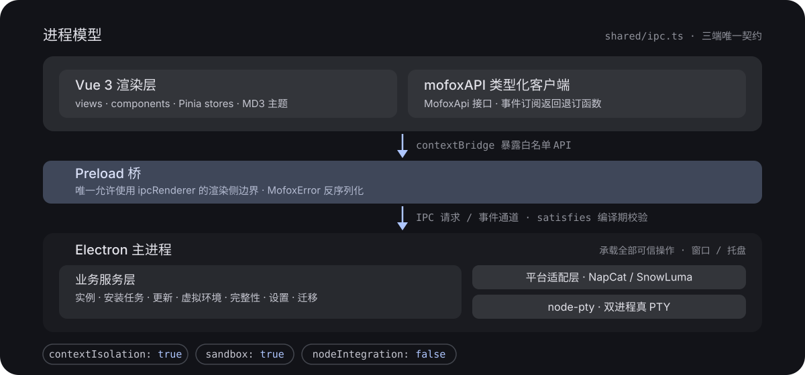

<p align="center">
  
</p>

<h3 align="center">一个桌面启动器，把 Neo-MoFox 机器人的安装、更新、运行、终端与日志收在一处。</h3>

<p align="center">
  
  
  
  
  
  
</p>

---

> 当前版本 `0.1.0`，处于早期开发阶段。本工程是旧版启动器的 TypeScript 全量重写：主进程、预加载层、服务层与 Vue 3 渲染层均以 TypeScript 重新实现，沿用 Material Design 3，保留 Electron 桌面运行时与既有业务语义。

## 它解决什么

跑一个 Neo-MoFox QQ 机器人，意味着同时管理 **MoFox 本体** 与 **平台适配器** 两个子进程，外加 Python 运行时、依赖安装、版本更新、日志排查与多套实例配置。命令行里开三个终端窗口、手工 `cd` 到不同目录、记住每条启动命令，是这套技术栈最常见的体验。

**Neo-MoFox Launcher Next** 把这套流程收进一个桌面应用：

- **卡片式实例列表** —— 状态（运行中 / 已停止 / 启动中 / 停止中 / 错误）一目了然，支持启停、重启、删除与打开安装目录
- **双进程独立控制** —— 每个实例最多运行 MoFox 本体与平台适配器两个子进程，分别启停、分别看日志
- **实时终端** —— 基于 `node-pty` + `xterm.js`，双进程双终端独立标签页，不是文本回显而是真 PTY
- **全自动安装与更新** —— 分阶段安装流水线、Git 版本管理、Python 虚拟环境，均在界面内完成

<p align="center">
  
</p>

## 快速开始

### 下载现成版本（想直接体验）

无需任何开发环境：前往 [GitHub Releases](https://github.com/MoFox-Studio/Neo-MoFox-Launcher-Next/releases) 下载最新的 **nightly 预发布版本**（标签 `nightly-日期`），按平台选择文件：

| 文件                                     | 适用平台                             |
| ---------------------------------------- | ------------------------------------ |
| `*-win-x64-setup.exe` / `*-portable.exe` | Windows 10/11 x64（安装版 / 便携版） |
| `*-win-ia32-*` / `*-win-arm64-*`         | Windows x86 / ARM64                  |
| `*-linux-x64.AppImage`                   | Linux x64 通用                       |
| `*-linux-x64.deb` / `*-linux-x64.rpm`    | Debian/Ubuntu、Fedora/RHEL/openSUSE  |
| `*-linux-arm64.*`                        | Linux ARM64                          |

> nightly 由 CI 自动构建的测试版本，可能不稳定，仅供测试体验；实际可用性以 NapCat / SnowLuma 的平台支持范围为准。

### 从源码运行

- **操作系统**：Windows 10/11（64 位）或主流 Linux 发行版；macOS 已列入打包配置，平台适配暂未覆盖
- **运行时**：Node.js 22+（推荐 LTS）与 npm

```bash
npm install
npm run dev
```

`npm run dev` 以 Vite 开发服务器（固定端口 `5199`）+ Electron 窗口的方式启动，renderer / main / preload 三端热更新并行运行。

> 没有开发经验、只想试试启动器？跟随 [从零运行启动器教程](./docs/从零运行启动器教程.md)，约 10–20 分钟即可从源码跑起来。
> 没有 Electron 环境也想看界面？`npm run dev:demo` 在浏览器中预览完整 UI（Vite + 内存 Mock API，可体验实例启停、终端日志流与安装进度）。

## 功能

### 实例与双进程

- 卡片式实例列表，状态一目了然；启动、停止、重启、删除实例，一键打开安装目录
- 每个实例最多运行两个子进程：**MoFox 本体**与**平台适配器**，分别独立控制
- 实例管理页整合信息查看、文件操作与实例信息修改

### 终端与日志

- 基于 `node-pty` + `xterm.js` 的实时终端，双进程双终端独立标签页
- 日志缓冲、关键词搜索、自动滚动、行数统计、进程运行时长与 PID 展示
- 日志一键导出到启动器数据目录

### 安装向导

- 引导界面：协议 → 配置 → 确认 → 安装
- 后台按 MoFox、平台、WebUI、配置与登记组织阶段，具体阶段取决于安装选项，实时上报进度
- 失败可在同一会话内从失败步骤断点续跑；不跨会话恢复安装。关闭窗口会先取消任务并清理临时文件
- 实际安装配置文件按 MoFox 的格式明文写入密钥，应妥善保护实例目录

### 更新与虚拟环境

- **主程序更新**：实例安装目录为 Git 仓库时，可查看当前分支与提交、远程分支列表、领先/落后提交数，支持切换分支、检出指定提交与一键拉取更新
- **平台更新**：列出平台仓库全部 Release（含预发布版本），一键升级适配器
- **虚拟环境**：基于 `uv` 管理 Python 虚拟环境与依赖包，支持镜像源与实时进度事件

### 平台适配层

- 插件化平台注册表，当前内置：
  - **NapCat**（基于 NapCatQQ 的 OneBot 11 接入，Windows x64）
  - **SnowLuma**（跨平台轻量适配器，Windows x64 / Linux x64、arm64）
- 从 GitHub Release 安装：镜像顺序轮询、SHA-256 校验、分块下载与安全解压。优先使用资产摘要，缺失时直连官方查找；仍无法验证时弹出风险确认，默认取消。摘要冲突或校验不匹配时始终拒绝，不提供绕过选项
- 智能探测实例启动入口，兼容不同版本的解压目录布局

### 个性化与系统集成

- Material Design 3 动态主题：跟随系统 / 浅色 / 深色 + 种子色；界面语言（简体中文 / English）
- 自定义壁纸与背景模糊效果
- 关闭时最小化到系统托盘，可从托盘菜单恢复或退出；启动器不在前台时，任务完成弹出系统通知
- 硬件加速开关、默认安装目录；日志轮转配置（单文件大小、归档天数、归档压缩），设置原子持久化

### 开箱引导与旧版迁移

- OOBE 引导页，自动检测 Python、uv、Git 版本并汇总系统环境信息
- 一键探测旧启动器数据目录，预览每条实例的规范化结果与冲突标记；支持按 ID / 路径冲突跳过，安全导入旧版 `instances.json`，不改动旧目录任何文件

### 安全与数据可靠

- `contextIsolation: true`、`sandbox: true`、`nodeIntegration: false`；渲染层仅能访问 preload 白名单 API，IPC 通道与事件均由共享类型契约约束
- 实例仓库与设置文件写入前保留 `.bak`；读取损坏文件时保留 `.corrupt.*` 副本并尝试从备份恢复，无法恢复时拒绝继续写入，避免用空列表覆盖原数据
- 版本化的实例仓库：高于当前支持版本的数据不会被旧版启动器覆盖

## 架构概览

<p align="center">
  
</p>

- **主进程**：承载全部可信操作 —— 文件系统、子进程与 PTY、安装任务、实例生命周期、更新、设置持久化、窗口与托盘管理。
- **预加载桥**：唯一允许使用 `ipcRenderer` 的渲染侧边界，仅暴露白名单 API；事件订阅返回退订函数，避免组件卸载后残留监听器。
- **渲染层**：只依赖 store、类型化 API 客户端与 UI 组件，禁止直接访问 Node.js 或 `ipcRenderer`。
- **类型契约**：`src/shared/ipc.ts` 是三端共享契约的唯一来源，借助 `satisfies` 在编译期校验通道名不漂移；主进程错误统一编码为 `MofoxError`，在 preload 层反序列化后以业务错误形式抛给渲染层。
- **平台适配层**：每个 Bot 平台实现统一的 `BotPlatform` 接口（元数据、可用性检查、安装、配置、更新、启动命令），由 `PlatformRegistry` 注册并按 ID 查找。

## 技术栈

| 层级            | 选型                                                                                           |
| --------------- | ---------------------------------------------------------------------------------------------- |
| 桌面运行时      | Electron 43                                                                                    |
| 主进程 / 预加载 | Node.js + TypeScript                                                                           |
| 渲染层          | Vue 3（Composition API + SFC）+ Vue Router + Pinia                                             |
| 构建工具        | Vite 6（renderer / main / preload 三入口独立构建）                                             |
| UI              | Material Design 3（`@material/web`、`@material/material-color-utilities`、`material-symbols`） |
| 终端            | `node-pty` + `@xterm/xterm`（fit / search / web-links 插件）                                   |
| 测试            | Vitest + jsdom                                                                                 |
| 代码质量        | TypeScript、ESLint、Prettier                                                                   |
| 打包            | electron-builder                                                                               |

## 开发

### 常用脚本

| 命令                   | 说明                                                              |
| ---------------------- | ----------------------------------------------------------------- |
| `npm run dev`          | 开发模式（renderer + main + preload + Electron 并行）             |
| `npm run dev:demo`     | 浏览器演示模式（Mock API）                                        |
| `npm run build`        | 类型检查 + 三端生产构建（输出到 `dist/`）                         |
| `npm run typecheck`    | 三端 TypeScript 类型检查                                          |
| `npm test`             | 运行 Vitest 单元测试                                              |
| `npm run lint`         | ESLint 静态检查                                                   |
| `npm run format:check` | Prettier 格式检查                                                 |
| `npm run pack:dir`     | 构建 + 重建原生模块 + electron-builder 打包目录产物（`release/`） |

### 环境变量

| 变量                    | 说明                                                                                   |
| ----------------------- | -------------------------------------------------------------------------------------- |
| `VITE_DEV_SERVER_URL`   | 开发模式下 Electron 加载的渲染地址（`npm run dev` 自动设置为 `http://localhost:5199`） |
| `VITE_MOFOX_DEMO`       | 设为 `true` 时启用浏览器演示 API（`src/renderer/src/services/mock-api.ts`）            |
| `NEO_MOFOX_LEGACY_DATA` | 覆盖旧启动器数据目录；默认探测 `<appData>/Neo-MoFox-Launcher`                          |

### 项目结构

```
Neo-MoFox-Launcher-Next/
├── src/
│   ├── main/                 # Electron 主进程
│   │   ├── index.ts          # 组合根：窗口、托盘、服务装配、IPC 注册
│   │   ├── ipc/              # IPC handler（core / install / instances / manage / update / venv / integrity / migration / window 等）
│   │   ├── platforms/        # Bot 平台适配层（napcat / snowluma + registry）
│   │   ├── services/         # 业务服务（实例仓库/运行时/更新/管理、安装任务、venv、完整性、OOBE、设置、迁移、镜像等）
│   │   └── utils/            # 工具层（logger、range-downloader、git、process-service、tray、background-notifier 等）
│   ├── preload/              # 预加载桥：contextBridge 暴露白名单 mofoxAPI
│   ├── renderer/             # Vue 3 渲染层
│   │   └── src/
│   │       ├── views/        # 页面（Dashboard / Instances / InstanceManage / InstanceLog / Install / Oobe / Settings）
│   │       ├── components/   # 通用组件与 install / oobe / manage 分区面板
│   │       ├── stores/       # Pinia（instances / install / settings）
│   │       ├── services/     # mofoxAPI 客户端、主题、Mock API
│   │       └── styles/       # Material 3 设计令牌与基础样式
│   └── shared/               # 三端共享
│       ├── ipc.ts            # IPC 请求/事件通道与 MofoxApi 类型契约（唯一来源）
│       └── domain/           # 领域模型（instance / update / venv / mirror / error 等）
├── test/                     # Vitest 单元测试（main / preload / renderer）
├── docs/                     # 设计文档与从零运行教程
└── electron-builder.yml      # 打包配置
```

### 测试

```bash
npm test
```

Vitest 单测覆盖主进程 IPC handler、业务服务（实例仓库、运行时、安装任务、venv、环境检测、设置、迁移）、平台运行时启动路径探测、工具层（logger、range-downloader、process-service 等）与渲染层 store / API 客户端。

## 打包与 CI

- **Nightly 预发布**：最近 24 小时有新提交时，nightly 工作流自动构建 Windows x64/ia32/arm64 与 Linux x64/arm64，并**发布到 GitHub Releases**（预发布标签 `nightly-日期`，附最近提交摘要，保留最近 6 个）。
- **CI 测试包**：普通 CI 在质量检查与原生模块冒烟测试通过后，生成 Windows x64 安装版/便携版与 Linux x64 AppImage/deb 测试包，存放于对应运行的 **Artifacts**（`Neo-MoFox-ci-运行编号-重跑次数-系统-x64`，保留 14 天），可通过 `workflow_dispatch` 手动触发，不发布到 Releases。
- **本地打包**：

```bash
npm run pack:dir
```

构建产物输出到 `release/`。打包目标（`electron-builder.yml`）：Windows `nsis` / `portable`，Linux AppImage / deb / rpm，macOS dmg。

注意：`node-pty` 为原生模块，打包前需 `npm run rebuild:native`（`pack:dir` 已包含）；打包目标不代表每个平台适配器都支持该架构，macOS 暂无 CI 打包验证。

## 与旧版的关系

|        | 旧版（Neo-MoFox-Launcher）  | 本工程（Next）                                      |
| ------ | --------------------------- | --------------------------------------------------- |
| 语言   | JavaScript（CommonJS）      | TypeScript                                          |
| 渲染层 | 原生 HTML/CSS/JS + 手写 DOM | Vue 3 + Vue Router + Pinia                          |
| 构建   | —                           | Vite（renderer / main / preload）                   |
| IPC    | 无类型 `window.mofoxAPI`    | 共享类型契约 `shared/ipc.ts`                        |
| 数据   | 旧 `instances.json` 格式    | 版本化仓库（`INSTANCES_VERSION`），内置旧版迁移入口 |

新工程不引用旧代码作为兼容层，但保留业务语义与数据兼容性；首次运行时可在设置/引导流程中从旧启动器数据目录一键迁移实例。

## 已知限制

- 处于早期开发阶段（`0.1.0`），部分界面与流程仍在完善中。
- NapCat 平台仅支持 Windows x64；SnowLuma 平台支持 Windows x64 与 Linux x64/arm64，macOS 暂未覆盖。
- 尚未提供 CHANGELOG 与贡献指南；提交与拉取请求会运行格式、Lint、类型、单测和生产构建检查。

## 相关项目

- [Neo-MoFox](https://github.com/MoFox-Studio/Neo-MoFox) —— QQ 机器人框架
- [NapCatQQ](https://github.com/NapNeko/NapCatQQ) —— 高性能 QQ 协议实现（OneBot 11）
- [SnowLuma](https://github.com/SnowLuma/SnowLuma) —— 跨平台 OneBot 11 轻量适配器
- [Electron](https://www.electronjs.org/) —— 跨平台桌面应用框架
- [Material Design 3](https://m3.material.io/) —— 设计系统
